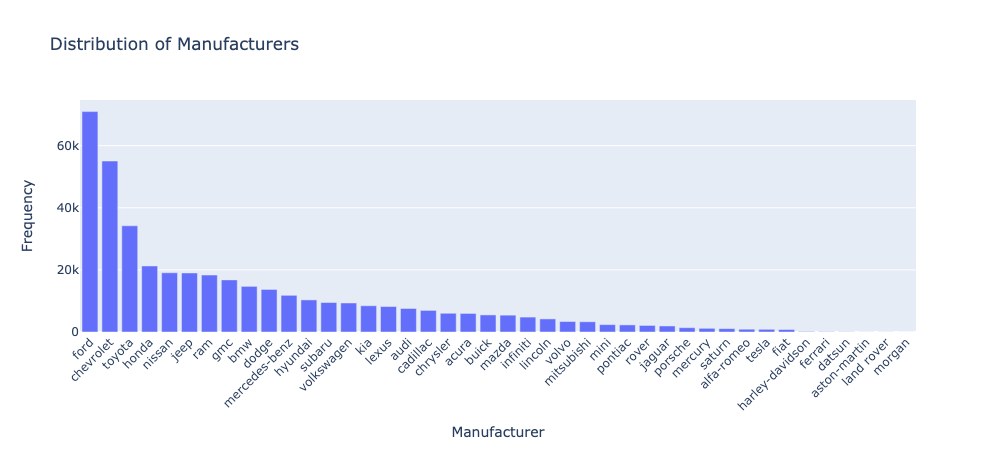

# Final Report: Used Car Price Prediction

## Business Understanding

In the competitive used car market, dealerships are constantly seeking ways to optimize their inventory and pricing strategies to maximize profitability. This analysis focuses on understanding the factors that make a car more or less expensive.

For this application, we explored a dataset sourced from Kaggle, which originally contained information on over 3 million used cars. To ensure efficient processing, the provided dataset was reduced to 426,000 cars while still maintaining a representative sample.

The primary goal is to identify the key features that influence car prices and provide actionable insights to the client — a used car dealership. These insights will enable the dealership to make informed decisions regarding inventory acquisition and pricing, ensuring they focus on what consumers truly value in a used car.

## Research Question

The key question addressed in this analysis is:

**"What are the main factors that determine the price of a used car?"**

By understanding these factors, dealerships can optimize their inventory by focusing on acquiring cars that are more likely to yield higher profits, while better pricing their current stock to reflect market trends.

## Insights into Data

The dataset used in this analysis contains detailed information about used cars, including their manufacturer, geographic distribution, and price range. Below are some key findings based on the analysis:

### **Manufacturers**
The distribution of manufacturers in the dataset reveals that **Ford, Chevrolet, and Toyota** are the most frequently listed manufacturers, with Ford having the highest number of listings at over 60,000. Other popular manufacturers include Honda, Nissan, and Jeep. The dataset also contains listings from luxury brands like Mercedes-Benz and BMW, albeit in smaller numbers.



This suggests that dealerships may want to focus more on stocking vehicles from these popular brands, as they are more frequently listed and may see higher consumer demand.

### **Geographic Distribution**
The geographic distribution of listings shows that **California**, **Florida**, and **Texas** have the highest number of used car listings, with California alone accounting for over 50,000 listings. This geographic concentration highlights potential markets where dealerships may want to focus their acquisition and sales strategies. States with a high volume of listings could indicate more competitive markets, while states with fewer listings might offer less competition but fewer sales opportunities.


### **Price Distribution**
When analyzing the price distribution, most vehicles fall into the $5,000 - $25,000 price range, with a large concentration around $15,000. There is a noticeable skew towards the lower end, suggesting that dealerships should target inventory in this price range, which aligns with consumer purchasing patterns. However, there are also several outliers, including cars priced at over $100,000, and even some vehicles listed under $500. Upon further investigation, these outliers appear to be incorrect or incomplete data, likely due to erroneous entries in the dataset.


### **Outliers and Data Quality**
While most of the data appears consistent, we found a significant number of outliers, particularly in price listings. Some vehicles were listed at extremely low or high prices, which are likely errors or incorrect data entries. For example, some cars were listed for as little as $0 or upwards of $1 million, which seems highly improbable. These anomalies highlight the need for careful data cleaning and verification in future analyses to ensure more accurate predictions and recommendations.


## Performance of the Chosen Model

We used different methods to find out which model could best predict used car prices. The main goal was to choose the one that makes the smallest mistakes when guessing prices. To measure how well each model performed, we looked at how far off the model's guesses were from the actual prices, on average.

### Model Accuracy

The best model we found was a **Linear Regression** model, which had an average error of +/- **$3.92**. This means that, on average, the model's price guesses were off by about $3.92. While it’s not perfect, it is still highly accurate. Given that the average price of a car in the dataset (excluding the 21 extreme and likely incorrect outliers) was **$17,939**, this translates to an accuracy of approximately **99.98%**.


### What Affects Price the Most

We also looked at which factors have the biggest impact on a car's price. The most important factors in determining price were:

- **Condition**: Cars in better condition are worth more.
- **Manufacturer**: Well-known brands like Ford and Chevrolet tend to increase a car's value.
- **Vehicle Type**: Larger vehicles like trucks and SUVs are often priced higher than sedans.
  
However, some factors mattered less in predicting price, such as:

- **Title status**: This had the least impact, even though it indicates if a car has been in an accident or has other issues.
- **Odometer reading (mileage)**: While we expect higher mileage to lower prices, in this dataset it wasn't as influential as other factors.

## Recommendations

Based on the analysis of the data and insights from the model, we propose the following recommendations for used car dealerships, focusing on what customers value most when purchasing used cars:

1. **Prioritize Cars in Good Condition**: Customers place a high value on the **condition** of a car. Vehicles in better condition consistently fetch higher prices. Dealerships should prioritize acquiring and marketing cars that are well-maintained or certified pre-owned. Highlighting the car's condition in listings can help attract more buyers and justify higher prices.

2. **Offer Popular and Trusted Brands**: Consumers tend to trust well-known manufacturers, with **Ford, Chevrolet, and Toyota** being the most frequently listed brands in our data. Stocking these popular brands will likely align with customer preferences, as these manufacturers are often associated with reliability and affordability. Dealerships should emphasize these brands in their inventory to meet consumer demand.

3. **Target Cars in the $5K-$25K Range**: Most customers are shopping within the **$5,000 to $25,000** price range, which is where the majority of listings fall. This suggests that dealerships should focus their inventory on this price range to meet customer budgets. Vehicles around **$15,000** are particularly popular, aligning with the average spending capacity of many buyers.

4. **Pay Attention to Mileage, but Focus on Other Factors**: While **mileage** is traditionally seen as important, our analysis showed that customers might be more flexible on mileage if the vehicle is in good condition or from a trusted manufacturer. Dealerships can reassure buyers by emphasizing the condition and maintenance history of cars, even those with higher mileage.

5. **Model Accuracy** The model's accuracy was found to be accurate within $3.92. This is a great starting point, and can be deployed to support in predicting the price of a used car by specifying the features of the car. This can help determine whether or not to purchase a car at a given price to be able to resell it at a profit.

By focusing on what customers value—reliability, condition, popular brands, and vehicle type—dealerships can better align their inventory and marketing strategies to meet consumer expectations and improve overall sales.

## Next steps
- Package and deploy model with application that can be used to predict the price of a used car.
- Test Model with additional data not used in training to further validate the model's performance.

## Outline of project

*Root Folder:*
- [Jupyter Notebook](prompt_II.ipynb)

*Data:*
- [Used Car Data](data/vehicles.csv)

*Utils:*
- Helper functions for the project that handle data cleaning, modeling, and evaluation.

*Images*
- Contains images used in the report of visualizations and tables.

## Installed Dependencies

### tabulate
Tabulate is used to display tables in the terminal. To install it, run the following command:
```
pip install tabulate
```
